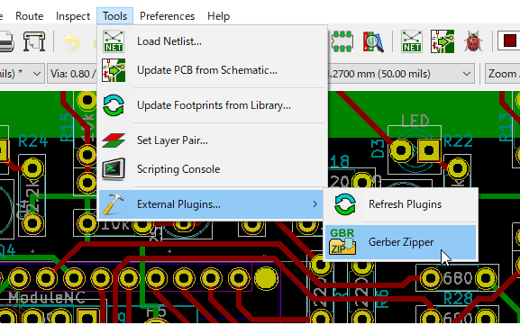
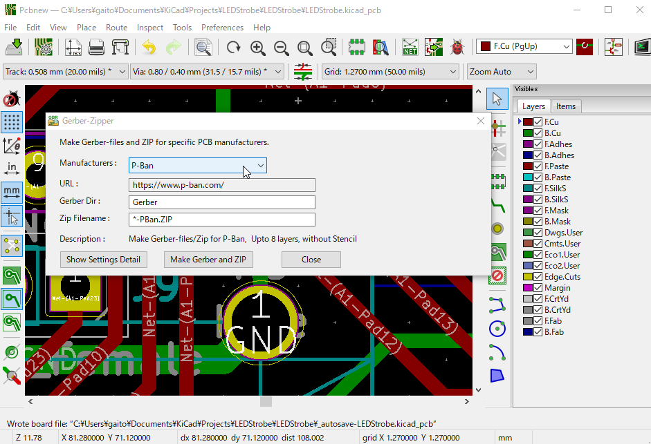
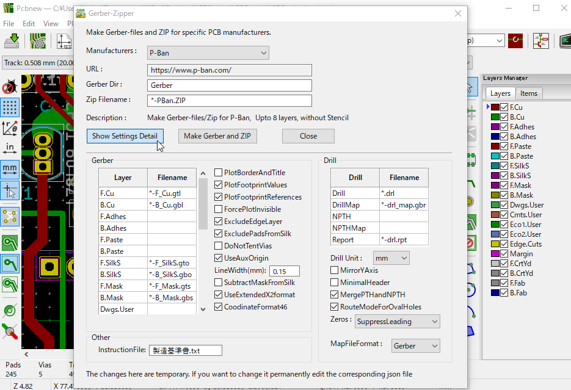

# kicad-gerberzipper

<span id="en">[English]</span> | [[日本語]](#ja)

---

### Overview

This is an action script that can be used with pcbnew since KiCad version 5.X (except the initial version).
Gerber output for the specified board vendor is performed, and the process of zipping the necessary files is automated with one click.

#### Note
 v1.0.4 - The setting where UseAuxOrigin was "true" in each manufacturer has been changed to "false". This is to avoid the possibility of coordinate troubles when outputting the pos file.

### Install

Place the `action_menu_gerber_zipper` folder as it is in the KiCad script folder. The script folder depends on the OS. 

- Linux:
  > `~/.kicad/scripting/plugins`

- Windows:
  > `C:\Users\<UserName>\AppData\Roaming\kicad\scripting\plugins`

- MacOS:
  > `~/Library/Application Support/kicad/scripting/plugins`  
  > or  
  > `~/Library/Preference/kicad/scripting/plugins`

The folder to put the script looks like this:

<pre>
.../kicad/scripting/plugins
     |
     +--- action_menu_gerber_zipper
             |
             +--- Manufacturers
             |        +---...
             +--- Locale
             |        +---...
             +--- __init__.py
             +--- gerber_zipper_action.py
             +--- icon.png
</pre>

- Please note that Windows AppData is a hidden folder.

- The folder where the script should be placed differs depending on the OS version etc. If it cannot launch at the above location, open Script Console from [Tools]-[Script Console] and enter the following command to confirm the folder.

 ```
 >>> import pcbnew
 >>> print(pcbnew.PLUGIN_DIRECTORIES_SEARCH)
 ```

### Usage

1. Select [Tools] -> [External Plugins...] -> [Gerber Zipper] from the pcbnew menu.  



2. In the dialog, select the manufacturer and click the [Make Gerber and ZIP] button to create a ZIP containing the Gerber and the necessary files. The default destination is the `Gerber` folder directly under the project file.  



3. Details of the current settings can be displayed by clicking the [Show settings details] button. Most of KiCad's plot and drill file creation can be set on this screen. (The setting changed here is temporary. If you want to change the setting permanently, edit the corresponding `json` file.)  



#### Current Manufacturers of choice

- Elecrow
- Elecrow with stencil
- FusionPCB
- JLCPCB
- P-Ban
- PCBWay

(The output files have been reviewed, but this includes those that have not been actually ordered and verified.)

#### Modify/Add your own settings 

Settings are written as `.json` files for each board manufacturer in the folder `Manufacturers`. Place the created configuration file here to add options.

##### Settings that require special attention
- Layer
   > Here, specify the layer and file name that need to be output. Therefore, there is no "Use Protel extension" option. For the inner layer, only the defined layers that have actual data will be output.
- UseExtendedX2format
   > This is a new Gerber format, but many manufacturers do not support it.
- MergePTHandNPTH
   > Correspondence varies depending on each board manufacturer. If not specify this, a file for unplated holes is required, but if you forget to attach the file, you may end up with a board that does not have the required holes.

#### Other settings

| Item                   | Description
|------------------------|-------------
| Layer                  | Specify the file name of the layer to output. Where '*' is replaced with the project name.
| PlotBorderAndTitle     | Output title and border. It is not normally used when outputting Gerber to a vendor.
| PlotFootPrintValues    | Prints the component values ​​on silk. Whether to output depends on the case.
| PlotFootPrintReferences| Prints the component references on silk. It is usually output because it is required for assembly.
| ForcePlotInvisible     | Forces the output of specified invisible characters.
| ExcludeEdgeLayer       | Excludes the board outline from layers other than `Edge.Cuts`. It is recommended by many manufacturers.
| ExcludePadsFromSilk    | If this is not checked, the outline of the pad will be drawn on the silk layer. Since it is mainly for documents, usualy checked for Gerber output.
| DoNotTentVias          | Prevents the via from being exposed. Whether to use it depends on the case.
| UseAuxOrigin           | Use auxiliary coordinates instead of absolute coordinates. Both are good in many cases, but it is safe to follow if there is a contractor's designation. In KiCad, you can set separate AuxOrigin settings for Gerber and drill files, but if they do not match, it will cause an accident, so GerberZipper controls both with this setting.
| LineWidth              | The default line width. It doesn't seem to be used much, but it is safe to follow if specified by manufacturer.
| SubtractMaskFromSilk   | Make sure that silk printing does not cover areas where copper is exposed, such as pads. Normally check.
| UseExtendedX2format    | Uses Gerber extended format. It is better not to check because there are many companies that do not support it.
| CoodinateFormat46      | Set the coordinate accuracy to `4.6,unit mm`. You can select `4.5,unit mm` or `4.6,unit mm`, but in most cases `4.6,unit mm` can be used.
| IncludeNetlistInfo     | This is an option to embed the netlist info in the Gerber. It is not normally used in data for the board manufacturer.
| Drill                  | A drill file in Excellon format. Gerber X2 format is not supported.
| DrillMap               | Drill map file. Some manufacturer may require it. The format depends on `MapFileFormat`.
| NPTH                   | Drill file for non-plated holes. Not required if MergePTHandNPTH is checked.
| NPTHMap                | This is a map file for unplated holes. The handling follows DrillMap.
| Drill Unit             | Specifies the unit of the drill file, either `mm` or `inches`. In many cases it is `mm`, but the `inches` may be specified by the manufacturer.
| MirrorYAxis            | Inverts the Y coordinate of the drill file. Not normally used.
| MinimalHeader          | Minimizes the header part of the drill file. It is rarely used, but may be specified by some manufacturers.
| MergePTHandNPTH        | Merge plated holes and unplated holes into one file. Often specified by the manufacturer.
| RouteModeForOvalHoles  | Use route command for Oval Holes if checked (recommended).
| Zoros                  | Select how to handle zeros. Many manufacturers use `DecimalFormats`, but different formats may be specified in some manufacturers.
| MapFileFormat          | Select the map file format. The format will be specified by the manufacturer.
| InstructionFile        | Creates the manufacturing standard document specified by P-Ban.com.


---

[[English]](#) <span id="ja"> | [日本語]</span>

### 概要

これは KiCad のバージョン5.X(初期版除く)以降の pcbnew で使用できるアクションスクリプトです。
指定の基板業者向けのガーバー出力を行い、必要なファイルを ZIP でまとめるまでをワンクリックで自動化します。

### インストール
　`action_menu_gerber_zipper` のフォルダをそのまま KiCad のスクリプトフォルダに配置してください。スクリプトフォルダは OS によって異なります。

- Linux:
  > `~/.kicad/scripting/plugins`

- Windows:
  > `C:\Users\<UserName>\AppData\Roaming\kicad\scripting\plugins`

- MacOS:
  > `~/Library/Application Support/kicad/scripting/plugins`  
  > または  
  > `~/Library/Preference/kicad/scripting/plugins`

スクリプトを置くフォルダは次のようになります:
<pre>
.../kicad/scripting/plugins
     |
     +--- action_menu_gerber_zipper
             |
             +--- Manufacturers
             |        +---...
             +--- Locale
             |        +---...
             +--- __init__.py
             +--- gerber_zipper_action.py
             +--- icon.png

</pre>

Windows の AppData は隠しフォルダになっている事に注意してください。

スクリプトを置くフォルダは OS バージョン等で異なります。 上記の場所で起動できない場合、[ツール]-[スクリプトコンソール]　で スクリプトコンソールを開き、次のコマンドを入力する事で確認できます。

```
>>> import pcbnew
>>> print(pcbnew.PLUGIN_DIRECTORIES_SEARCH)
```


### 使用法

1. pcbnew のメニューから [ツール(Tools)] - [外部プラグイン...(External Plugins)] - [Gerber Zipper] を選択します。  

  


2. ダイアログが表示されますので、基板業者を選択して [ガーバーとZIPファイルの作成(Make Gerber and ZIP)] ボタンを押すとガーバーと必要なファイルをまとめたZIPが作成されます。作成先はデフォルトではプロジェクトファイルの直下の Gerber フォルダです。  

  


3. 現在の設定の詳細は [設定の詳細を見る] ボタンを押すと表示されます。この画面では KiCadのプロットとドリルファイル作成にある殆どの項目が設定できます。(ここで変更した設定は一時的なものになります。恒久的に設定を変えたい場合は対応する json ファイルを編集してください)  

  


#### 現在選択肢にある業者

- Elecrow
- Elecrow ステンシル付き
- FusionPCB
- JLCPCB
- P板.com
- PCBWay

(出力されたファイルは確認していますが、実際に発注して確認していないものも含みます)

#### 自分で設定を変更/追加する

`Manufacturers` フォルダ内に基板業者毎に `.json` ファイルで設定が書かれています。既存のファイルを編集して作成した設定ファイルをここに配置すると選択肢が追加されます。

##### 特に注意が必要な設定
- Layer
  > ここで出力が必要なレイヤーとファイル名を指定します。そのため「Protel の拡張子を利用」のオプションはありません。また内層のレイヤーについては定義されているものの内、実際にデータが存在するレイヤーのみが出力されます。
- UseExtendedX2format
  > ガーバーの新しいフォーマットですが、対応していない業者が多いです。
- MergePTHandNPTH
  > 対応が基板業者毎に異なります。これを指定しない場合メッキなし穴用のファイルが必要になりますが添付忘れにより必要な穴が開いていない基板ができてしまう事故が起こる事があります。


##### その他の設定

| 項目                   |  日本語メニューでの説明       | 備考
|------------------------|-----------------------------|------
| Layer                  |                       |出力するレイヤーのファイル名を指定します。ここで'*' はプロジェクトの名前に置換されます。
| PlotBorderAndTitle     | 境界線とタイトルブロックをプロット | タイトルと枠を出力します。業者に出すガーバー出力の際は通常使用しません。
| PlotFootPrintValues    | フットプリントのリファレンスをプロット|部品の値をシルクに出力します。出力するかどうかは場合によります。
| PlotFootPrintReferences| フットプリントのリファレンスをプロット|部品のリファレンスをシルクに出力します。組立に必要なので通常は出力します。
| ForcePlotInvisible     | 非表示の定数/リファレンスを強制的にプロット|非表示指定した文字を強制的に出力します。
| ExcludeEdgeLayer       | 基板外形レイヤーのデータを他のレイヤーから除外|基板外形を Edge.Cuts 以外のレイヤーから除去します。多くの業者でこれを指定する事が推奨されています。
| ExcludePadsFromSilk    | シルクからパッドを除外|これをチェックしない場合シルクレイヤーにパッドの外形が描かれます。ドキュメント用なのでガーバー出力の際には使用しません。
| DoNotTentVias          | ビアのテンティングを禁止|ビアにレジストがかからないようにして露出させます。使用するかどうかは場合によります。
| UseAuxOrigin           | 原点に補助座標を使用|絶対座標の代わりに補助座標を使用します。どちらでも良い事が多いですが業者の指定があれば従うのが無難です。KiCad ではガーバーとドリルファイルのそれぞれで AuxOrigin の設定ができますが、双方が一致していないと事故の元ですのでGerberZipper ではこの設定で両方を制御します。
| LineWidth              | デフォルトの線幅 | 太さの指定がない場合の線幅です。実際にはあまり使用されていないようですが、指定があれば従うのが無難です。
| SubtractMaskFromSilk   | シルクをレジストで抜く | パッド等のレジストが無い部分にシルク印刷がかぶらないようにします。通常はチェックします。
| UseExtendedX2format    | 拡張X2フォーマットを使用|ガーバーの拡張フォーマットを使用します。対応していない業者が多いためチェックしない方が良いです。
| CoodinateFormat46      | 座標フォーマット|座標の精度を 4.6,単位 mm にします。4.5,単位 mm または 4.6,単位 mm の選択ですが、大抵の場合 4.6,単位 mm が使用できます。
| IncludeNetlistInfo     | ネットリスト属性を含む|ガーバーデータにネットリスト情報を埋め込むオプションです。基板業者に渡すデータでは通常は使用されません。
| Drill                  | |Excellon 形式のドリルファイルです。Gerber X2 はサポートしていません。
| DrillMap               | |ドリルマップファイルです。業者によっては要求される場合があります。フォーマットは MapFileFormat に依存します。
| NPTH                   | |メッキなし穴のドリルファイルです。MergePTHandNPTH がチェックされている場合は不要です。
| NPTHMap                | |メッキなし穴のマップファイルです。扱いは DrillMap に準じます。
| Drill Unit             | ドリル単位|ドリルファイルの単位で mm か インチかを指定します。多くの場合 mm ですが業者によってインチが指定されている場合があります。
| MirrorYAxis            | Y軸でミラー|Y軸でミラードリルファイルのY座標を反転させます。通常は使用しません。
| MinimalHeader          | 最小のヘッダー|ドリルファイルのヘッダー部を最小化します。あまり使用されませんが業者による指定がある場合があります。
| MergePTHandNPTH        | PTHとNPTHを一つのファイルにマージ|メッキ穴とメッキなし穴を1ファイルにまとめます。業者によって指定されている事が多いです。
| RouteModeForOvalHoles  | 長円穴ドリルモード| チェックすると route コマンドを使用します(推奨)
| Zoros                  | ゼロの扱い|ドリルファイルの少数の扱いを選択します。DecimalFormatが多いですが、違うフォーマットが指定されている場合もあります。
| MapFileFormat          | マップファイルフォーマット|マップファイルのフォーマットを選択します。マップファイルが要求される場合はフォーマットも指定されます。
| InstructionFile        | |P板.comで指定されている製造基準書を作成します。
|________________________|______________________________|___

